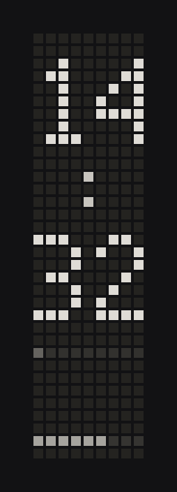

# Lotus

An [Omarchy](https://omarchy.org/) plugin for the Framework Laptop 16 LED
matrix — the 9×34 greyscale module that sits next to the keyboard.

A live preview of the same 9×34 grid lives in the bar. Click it for a
panel: pick a mode, set brightness, sleep the module. Auto mode keeps a
clock up, then steps aside when something more useful happens.

Without the hardware, the bar still runs the sculpture. With it, Lotus
talks to the module over USB serial (no extra Python packages) and keeps
it awake so the firmware's idle timer does not blank the panel.



## Modes

| Mode | What it shows |
|------|----------------|
| **Auto** | Clock, until battery is low, music is playing, a notification lands, or the session is idle |
| **Clock** | Hours stacked over minutes, seconds as a bar, battery as a ribbon |
| **Battery** | Two-digit charge and a filling cell |
| **Spaces** | Hyprland workspaces 1–10, focused vs occupied |
| **Lotus** | A breathing bloom — the thing this module was born showing |
| **Rain** | Falling sparks, used as the idle screensaver |
| **Meter** | Per-core load, nine columns, peak hold |
| **Breathe** | Full-panel pulse |
| **Sleep** | Firmware sleep; the LEDs go dark |

Auto also flashes the matrix when a desktop notification appears, and
can sleep it when the session locks.

## Install

```sh
omarchy plugin add https://github.com/TomFaulkner/lotus.git --enable
```

From this checkout:

```sh
ln -sfn "$PWD" ~/.config/omarchy/plugins/io.github.tomfaulkner.lotus
omarchy plugin validate ~/.config/omarchy/plugins/io.github.tomfaulkner.lotus
omarchy plugin enable io.github.tomfaulkner.lotus --section right
```

The widget lands on the right of the bar. Move it with:

```sh
omarchy bar move io.github.tomfaulkner.lotus --section center
```

### LED matrix access

The module shows up as `/dev/ttyACM*` (`32ac:0020`). A one-time udev
rule lets your session open it without root. Lotus ships the official
Framework rule and can install it from the panel (polkit prompt), or:

```sh
sudo install -m 644 udev/50-framework-inputmodule.rules /etc/udev/rules.d/
sudo udevadm control --reload-rules
sudo udevadm trigger --subsystem-match=tty --action=change
```

Unplug and replug the module if the ACL does not apply immediately.

`python3` is the only runtime dependency; Omarchy already has it.

## Controls

- Left click the bar mark: open the panel
- Right click: cycle modes
- Middle click: sleep / wake
- Scroll: brightness
- In the panel, arrows pick a mode, enter applies it, left/right dim or brighten, space sleeps

Pixel values below about 10 do not show on this module. Lotus keeps
global brightness in the 10–255 range for that reason.

IPC, if you want a keybind:

```lua
o.bind("SUPER + CTRL + L", "Lotus", "omarchy-shell io.github.tomfaulkner.lotus cycle")
```

```sh
omarchy-shell io.github.tomfaulkner.lotus toggle
omarchy-shell io.github.tomfaulkner.lotus flash
omarchy-shell io.github.tomfaulkner.lotus status
```

## Remove

```sh
omarchy plugin disable io.github.tomfaulkner.lotus
omarchy plugin remove io.github.tomfaulkner.lotus --yes
```

Settings live in `${XDG_STATE_HOME:-~/.local/state}/omarchy/lotus.json`
and are not deleted with the plugin. The udev rule, if you installed it,
stays in `/etc/udev/rules.d/` until you remove that file yourself.

## Development

```
manifest.json     kinds, entry points, bar widget metadata
Service.qml       daemon lifecycle, Hyprland / battery / idle / notifications
BarWidget.qml     9×34 mark on the bar
Panel.qml         mode picker and brightness
MatrixPreview.qml shared LED canvas
Model.js          settings and mode list
scripts/lotusd.py serial protocol and renderers
udev/             Framework input-module access rule
test/             python tests for protocol and frames
```

```sh
python3 -m unittest discover -s test -v
python3 scripts/lotusd.py --list
python3 scripts/lotusd.py --render clock
omarchy plugin validate .
```

The daemon speaks newline JSON on stdin/stdout. QML pushes desktop
state; the daemon replies with `status` and a base64 `preview` of the
current 9×34 frame, then writes greyscale columns to any LED matrix it
can open.

## Marketplace

Category **Hardware**. Tags: `bar`, `hyprland`, `theme`.
